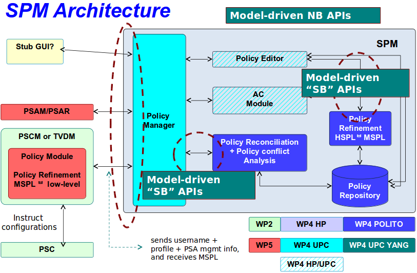

# SPM: Security Policy Module

## Table of Contents
* [SPM Architecture](#spm-architecture)
* [Prerequisites](#prerequisites)
* [Installing and running the SPM](#installing-and-running-the-spm)
* [Trying SPM services REST APIs](#trying-spm-services-rest-apis)
* [Eclipse IDE](#eclipse-ide)

## SPM Architecture


Currently the SPM is based on the Model Driven SAL of the OpenDayLight (ODL) network controller, 
extended with the following three modules:

1. **m2lservice**

    This module performs the translation between MSPL language to low level PSA configuration. To this end, the PSA plugin is requested from a PSA plugin 
    repository, locally executed passing as input the MSPL policies. As a result, the low level PSA specific configurations are returned.

2. **h2mservice (Refinement Service)**

    High to medium language (HSPL->MSPL) translation and refinement service.

3. **reconciliation service**
    - reconciliation
    - multi-user-conflict-analysis
    - single-user-conflict-analysis of one policy
    - single-user-conflict-analysis of all policies


## Prerequisites
* Java 1.7+, including the JDK
* Apache Maven 3.2.1+

```bash
$ apt-get install ant 
```

### Installing Apache Maven 3.2.1
*  [Instructions here](docs/Install_apache_maven.md)

## Installing and running the SPM
1. Clone the SPM project

    ```sh
    $ cd $HOME
    $ git clone https://github.com/SECURED-FP7/secured-spm.git
    ```
    
2. Compile

    ```sh
    $ cd secured-spm/spm/spmdist/
    $ mvn clean install -DskipTests
    ```
    > Note: you can speed-up the compilation process by skipping testing using the -DskipTests flag (i.e. `mvn clean install -DskipTests`)


3. Start the SPM
 
    First of all we need to run M2LServiceCoordinator and M2LPluginService:

    ```sh
    $ cd $HOME/secured-spm/spm/m2lservice/
    $ tar xzf test_configuration_tomcat.tar.gz
    $ cd test_configuration_tomcat/apache-tomcat-8.0.24_M2LPluginService_M2LServiceCoordinator/bin/
    $ ./startup.sh
    ```
    
    Wait some minutes, until the page http://localhost:8090/ is available

    ```sh
    $ cd $HOME/secured-spm/spm/spmdist/
    $ karaf/target/assembly/bin/karaf
    ```
    After few seconds you will see a prompt (see below). Now you are in the karaf console.
    ```
        ________                       ________                .__  .__       .__     __    
        \_____  \ ______   ____   ____ \______ \ _____  ___.__.|  | |__| ____ |  |___/  |_  
         /   |   \\____ \_/ __ \ /    \ |    |  \\__  \<   |  ||  | |  |/ ___\|  |  \   __\ 
        /    |    \  |_> >  ___/|   |  \|    `   \/ __ \\___  ||  |_|  / /_/  >   Y  \  |   
        \_______  /   __/ \___  >___|  /_______  (____  / ____||____/__\___  /|___|  /__|   
                \/|__|        \/     \/        \/     \/\/            /_____/      \/       
                                                                                            
    
    Hit '<tab>' for a list of available commands
    and '[cmd] --help' for help on a specific command.
    Hit '<ctrl-d>' or type 'system:shutdown' or 'logout' to shutdown OpenDaylight.
    
    opendaylight-user@root>
    ```
    
6. Execute the modules

    **Medium 2 Low servcie**
    ```
    $ feature:install odl-m2lservice-ui
    ```
    
    **High 2 Medium servcie (Refinement service)**
    ```
    $ feature:install odl-h2mservice-ui
    ```
    
    **Reconciliation service**
    ```
    $ feature:install odl-reconciliation-ui
    ```
    
    Wait a couple of minutes until the modules are loaded. You can verify whether the modules are loaded by browsing [http://localhost:8181/apidoc/explorer/index.html](http://localhost:8181/apidoc/explorer/index.html), credentials admin:admin. In the list, you should find the following three modules.

        * m2lservice(2015-01-05)
        * h2mservice(2015-01-05)
        * reconciliation(2015-01-05)

    
    
## REST API calls

### Medium 2 Low Service
1. Go to the *spm_repo_dir* folder.

2. Execute:

    ```sh
    curl -i -u "admin":"admin" -H "Content-Type: application/yang.data+json" \
    -X POST http://localhost:8181/restconf/operations/m2lservice:m2ltranslate \
    -d @m2lservice-test-files/m2lservice_input.json
    ```

    The [m2lservice_input.json](m2lservice-test-files/m2lservice_input.json) is a json:
    
    ```
    {
        "input": {
            "mspl_rules": " <?xml version='1.0'?><MSPL></MSPL>",
            "security_control": "netfilter/iptables"
        }
    }
    ```
    The mspl_rules parameter contains all the mspl rulse defined in a xml format.
    
    
3. The output result;

    ```
    HTTP/1.1 200 OK
    Content-Type: application/yang.operation+json
    Transfer-Encoding: chunked
    Server: Jetty(8.1.15.v20140411)

    {
        "output": {
            "psa_config": "This file contains specific configuration for the security control\n <?xml version='1.0'?><MSPL><netfilter></netfilter></MSPL"
        }
    }
    ```
    
    the psa_config parameter contains all the PSA specific configurations.

### High 2 Medium Service (Refinement)
1. Go to the *spm_repo_dir* folder.

2. Execute:

    ```sh
    curl -i -u "admin":"admin" -H "Content-Type: application/yang.data+json" \
    -X POST http://localhost:8181/restconf/operations/h2mservice:h2mrefinement \
    -d @h2mservice-test-files/h2mservice_input.json
    ```

    The [h2mservice_input.json](h2mservice-test-files/h2mservice_input.json) is a json file with the input parameter values.
    
    Note: the field  hspl_mspl, sPSA_SG, userPSA, marketPSA, subject_string, content_string, target_string must be encoded base64.
    
    
3. The output result;

    ```
    HTTP/1.1 200 OK
    Content-Type: application/yang.operation+json
    Transfer-Encoding: chunked
    Server: Jetty(8.1.15.v20140411)
    
    {
        "output": {
            "application_graph": "<xml>",
            "MSPL": [ "<xml>", "..."
            ],
            "remediation": "<xml>"
        }
    }
    ```
    

   
    
    Note: the MSPL, application_graph and  are encoded base64.

    
### Reconciliation Service
This module has implemented four diferent APIs:

#### Reconciliation
1. Go to the *spm_repo_dir* folder.

2. Execute:

    ```sh
    curl -i -u "admin":"admin" -H "Content-Type: application/yang.data+json" \
    -X POST http://localhost:8181/restconf/operations/reconciliation:reconciliation \
    -d @reconciliation-test-files/reconciliation_input.json
    ```

    The [reconciliation_input.json](reconciliation-test-files/reconciliation_input.json) is a json file with the input parameter values.
        
    
3. The output result;

    ```
    HTTP/1.1 100 Continue
    HTTP/1.1 200 OK
    Content-Type: application/yang.operation+json
    Transfer-Encoding: chunked
    Server: Jetty(8.1.15.v20140411)

    {
        "output": {
            "report": "PCFET0NUWVBFIGh0bWw+Cjx...",
            "MSPL": [
                "PD94bWwgdmVyc2lvbj0iMS4wIiB...",
                "PD94bWwgdmVyc2lvbj0iMS4wIiBlbmNvZGluZz0iVVRGLTgiIHN0YW5kYWxvbmU9InllcyI..."
            ],
            "application_graph": "PD94bWwgdmVyc2lvbj0iMS4wIiBlbmNvZGluZz0iVVRGLTgiIHN0YW5kY..."
        }
    }
    ```

#### multi-user-conflict-analysis
1. Go to the *spm_repo_dir* folder.

2. Execute:

    ```sh
    curl -i -u "admin":"admin" -H "Content-Type: application/yang.data+json" \
    -X POST http://localhost:8181/restconf/operations/reconciliation:muca \
    -d @reconciliation-test-files/MUCA_input.json
    ```

    The [MUCA_input.json](reconciliation-test-files/MUCA_input.json) is a json file with the input parameter values.
        
    
3. The output result;

    ```
    HTTP/1.1 100 Continue
    HTTP/1.1 200 OK
    Content-Type: application/yang.operation+json
    Transfer-Encoding: chunked
    Server: Jetty(8.1.15.v20140411)

    {
        "output": {
            "report":"PCFET0NUWIAo=..."
        }
    }
    ```

#### single-user-conflict-analysis of one policy
1. Go to the *spm_repo_dir* folder.

2. Execute:

    ```sh
    curl -i -u "admin":"admin" -H "Content-Type: application/yang.data+json" \
    -X POST http://localhost:8181/restconf/operations/reconciliation:sucas \
    -d @reconciliation-test-files/SUCAS_input.json
    ```

    The [SUCAS_input.json](reconciliation-test-files/SUCAS_input.json) is a json file with the input parameter values.
        
    
3. The output result;

    ```
    HTTP/1.1 200 OK
    Content-Type: application/yang.operation+json
    Transfer-Encoding: chunked
    Server: Jetty(8.1.15.v20140411)

    {
        "output": {
            "report":"PCFET0NUWVBFIGh0bWw+CjxodG1s..."
        }
    }
    ```

#### single-user-conflict-analysis of all policies
1. Go to the *spm_repo_dir* folder.

2. Execute:

    ```sh
    curl -i -u "admin":"admin" -H "Content-Type: application/yang.data+json" \
    -X POST http://localhost:8181/restconf/operations/reconciliation:sucad \
    -d @reconciliation-test-files/SUCAD_input.json
    ```

    The [SUCAD_input.json](reconciliation-test-files/SUCAD_input.json) is a json file with the input parameter values.
        
    
3. The output result;

    ```
    HTTP/1.1 200 OK
    Content-Type: application/yang.operation+json
    Transfer-Encoding: chunked
    Server: Jetty(8.1.15.v20140411)

    {
        "output": {
            "report":"PCFET0NUWVBFIGh0bW..."
        }
    }
    ```

## Eclipse IDE
*  [Instructions here](docs/Import_eclipse.md)
